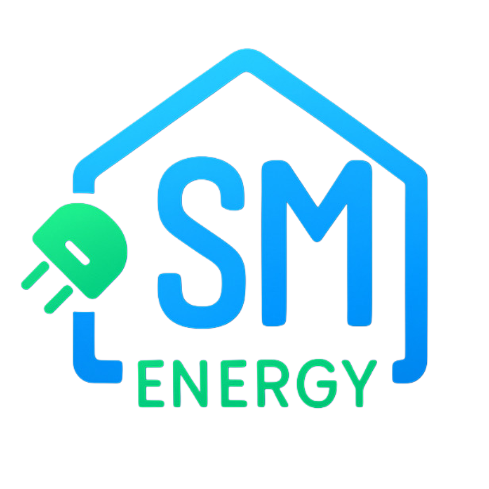

# SMEnergy

SMEnergy é uma solução de monitorização energética composta por uma app Flutter, firmware para ESP32 e documentação técnica de integração. O objetivo do projeto é ligar sensores de consumo a uma conta de utilizador, recolher leituras em Firestore e apresentar esses dados numa experiência mobile simples: dashboard em tempo quase real, histórico, alertas, configuração do equipamento e estimativa de custos de eletricidade.

## Visão Geral

- `lib/`: aplicação mobile Flutter com autenticação Firebase, dashboard, histórico, alertas, perfil e onboarding do equipamento.
- `firmware/`: firmware PlatformIO para ESP32 com provisioning via access point local e envio de leituras para Firestore.

